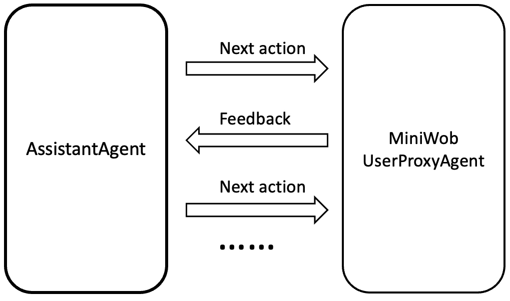
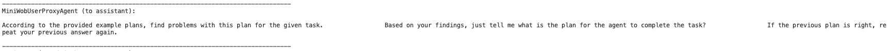
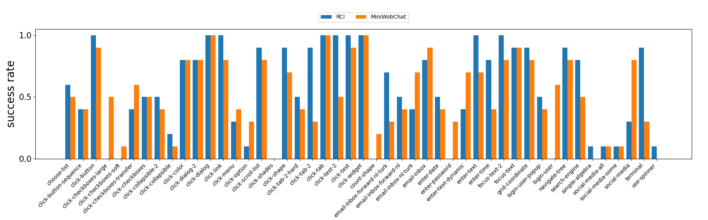

# Browser interactions application

## Miniwob++


The goal of the benchmark Miniwob++ is to train machine learning models (agents) to do things in a browser that can be specified in natural language. It contains a collection of over 100 web interaction environments along with JavaScript and Python interfaces for programmatically interacting with them. It use The Gymnasium interface allows an agent to initialize and interact with a MiniWoB++ environment as follows:
```
import gymnasium
env = gymnasium.make('miniwob/click-test-2-v1', render_mode='human')
try:
  observation, info = env.reset(seed=42)
  for _ in range(1000):
    action = policy(observation)  # User-defined policy function
    observation, reward, terminated, truncated, info = env.step(action)
    if terminated:
      observation, info = env.reset()
finally:
  env.close()
```

## Miniwob++ integration with Autogen
Miniwob++ provides a suitable environment to evaluate the ability of an agent to interact with a dynamic environment. Agent interacting with a dynamic environmental system to accomplish tasks seems to be a very common scenario. For example, most reinforcement learning scenarios. These interactions process could be characterized by the following two points:
1. Some essential information needs to be obtained by interactions between the agent and the environment.
2. The environment is dynamic and therefore agent needs to adapt its behavior to the environment at each moment in time.  


We want to demonstrate:

1. **Off-the-shelf implementation:** Leverage Assistantagent and "UserProxyAgents".



2. **Programmable and Modularity:**

(1) Users can customize their own intelligent agent in the AssistantAgent, and can also create their own environment in the UserproxyAgent. 

(2) The environment and the agent are decoupled, and neither will affect the other when the other changes. This is convenient for later maintenance and modification.

## How to run


### Setup

```sh
conda install --yes --file requirements.txt 
cd computergym
pip install -e .
```


### Run
**Step 1:** Set up openai key in *main.py* and *config.json*.  


**Step 2:**
To run the code, simply execute the following command:
```sh
python main.py --problem [problem_name]
```
Available problems are in *available_tasks.txt.*


## Demo

#### 1. Run command 

```sh
python main.py --problem click-button-sequence
```


#### 2. MiniWobUserProxyAgent sends enviroment and task information to the AssistantAgent


#### 3. Get initial plan from the AssistantAgent


#### 4. AssistantAgent checks the initial plan's problems.



#### 5. Excute step 1 based on current plan and environments


#### 6. Excute step 2 based on current plan and environments


#### 7. Task Success


## Evaluation



1. Including all clicking tasks from easy to hard
2. Remove examples that will exceed tokens limit when agent interactions 

